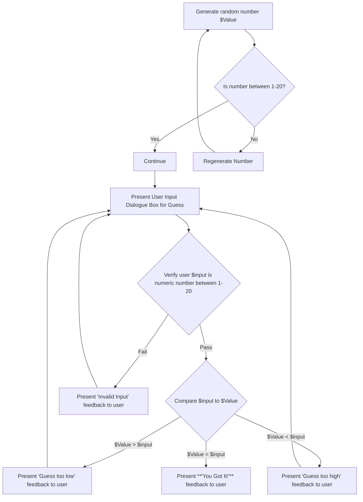

1. Computer generates a random number, set this number as $Value
2. Run a check to verify generated number is a numeric value between 1-20
    1. If yes, continue
    2. If no, return to step 1
3. Present user with input dialogue box and instructions to enter a number between 1-20 to guess $Value, set user input as $input
4. Verify $input is numeric value between 1-20
    1. If Fail, return to step 3
    2. If Pass, continue to step 5
5. Compare $input to $Value
    1. If $Value>$input, present "Guess too low" to user
        1. Return to step 3
    2. If $Value<$input, present "Guess too high" to user
        1. Return to step 3
    3. If $Value=$input, present **"You Got It"** to user