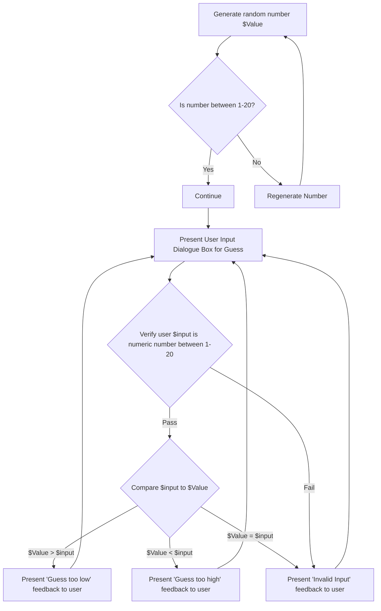

```mermaid
flowchart TD
A[Generate random number $Value] --> B{Is number between 1-20?}
B --> |Yes| C[Continue]
B --> |No| D[Regenerate Number]
D --> A
C --> E[Present User Input Dialogue Box for Guess]
E --> F{Verify user $input is numeric number between 1-20}
F --> |Pass| G{Compare $input to $Value}
G --> |$Value > $input| H[Present 'Guess too low' feedback to user]
G --> |$Value < $input| I[Present 'Guess too high' feedback to user]
G --> |$Value = $input| J[Present **'You Got It!'** feedback to user]
H --> E
I --> E
F --> |Fail| J[Present 'Invalid Input' feedback to user]
J --> E
```